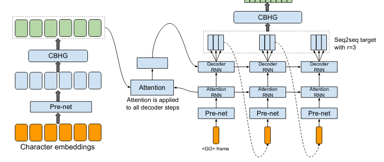
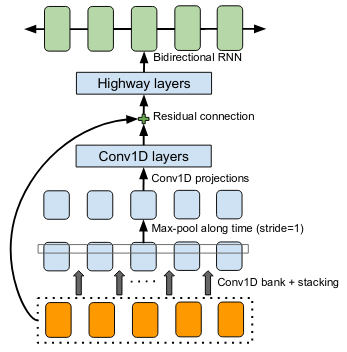

== Diacritization in Arabic with Deep Learning

=== Intro

Diacritization is the art of completing arabic scripts with the correct
vocalization, which is a task that only advanced arabic speakers successfully
manage.

This blog explains how we have learned to do it with an advanced research
architectures before porting it into production in _Ruby_ and _Javascript_.

==== Arabic within the Languages landscape

Arabic is geographically spread across a broad band ranging from north Africa to
Afghanistan and Pakistan and is intrinsically connected with the Islamic
Civilisation.

Within the main languages classes, arabic finds itself within the so-called
Abjad writing system:

* Alphabetical (English, Spanish, French, Roman, …)
* *Abjad* (*Arabic*, Hebrew, Aramaic, …)
* Logographic and syllabic (Mandarine,
Japanese, …)
* Abugida (Hindi, Thai, Khmer, Bhurmese, …)

Characteristics of this group is in which each symbol or glyph stands for a
consonant, in effect leaving it to readers to infer or otherwise supply an
appropriate vowel.

==== What is Diacritization

As a result, in Arabic, a set of consonants can be pronounced in several ways as
well as have multiple meanings. This ensure a great plasticity of the language
and so native speaker are used to write it that way and to infer meanings and
pronunciations from the context.

Inversely, in Arabic, and unlike many other languages the vocalization can be
exactly specified via diacritics: symbols added over or under the consonants as
in colour, in the image below.
image:../public/figs/Elements_of_Arabic_script_improved.png[Example of arabic with
diacritization]

Writing arabic with diacritics is useful for language learners. It has also some
importance for instance in sacred literature and also for praying. As natural
consequence, the Qur’an constitutes the purest reference for diacritization.

===== Applications in Informatics?

It is also obviously useful and essential for resp. NLP or *text to speech* and
obviously *transliteration*.

===== Arabic Diacritics, ``Al Tashkīl'' تَشْكِيل

Below, a list and examples of the basic diacritics:

image:/home/jair/WorK/UpWork/arabic-diacritization/blogs/PHONETIC-TRANSCRIPTION-FOR-ARABIC-DIACRITICS-USED-IN-QURAN-CORPUS.png[diacritics
examples] Furthermore, diacritics have also possible combinations:

* Shaddah+Fatha
* Shaddah+Kasra
* Shaddah+Kasratan
* Shaddah+Dammatan
* Shaddah+Fathatah.

===== Practical Examples

* فلسطين‎ reads FLSTIN and could be transliterated as Filasṭīn or in arabic
after correct diacritization فِلَسْطِين.
* an example of multiple meaning or *collision* is the following: قَطَر (Qatar -
a country) قُطْر (Qotr - circle diameter) قَطْر (Qatr - rain)

===== Diacritization in Interscript

Interscript provides with mappings allowing to transliterate many languages into
latine alphabet. In that context, abjad languages need to be processed via
several steps:

* *arabic text* => *diacritization* => *transliteration*

=== Diacritization with Deep Learning

Correct diacritization requires an accurate understanding not only of the
language morphemes and their declinaisons but also the language grammar.

Furthermore, given the possible multiple meanings available to a particular word
in arabic (or collision), some understanding of the context is required!

==== Approaches

This hard problem has been approached in various ways with an evolution quite
typical:

1. Rules based approaches
2. Machine learning based approaches
3. Deep Learning approaches

For more details, we have reviewed the latest publications, tested the latest
code bases and summarised the latest research ideas
https://github.com/interscript/rababa/blob/master/docs/research-arabic-diacritization-06-2021.adoc[here].

=== Production Requirements

In our technology choice, we obviously want to use the best research library or
architecture.

However, we need to be able to:

* run the code quickly on standard CPU’s
* run code from javascript, which is achieved here with the following workflow:
  1. Implementation and training of neural networks with pytorch
  2. Conversion pytorch –> ONNX
  3. Load ONNX model from ruby
  4. Conversion ruby –> javascript, as documented in
https://github.com/interscript/interscript.org/blob/master/posts/WebAssembly_and_advanced_regular_expressions_with_Opal.adoc[interscript
blog]
* size of the model < 200MB
* and finally publish a usable and documented
public library

=== Training & Results

==== Architecture

After careful review and testing of the latest research libraries available, we
have decided to use following
https://github.com/almodhfer/Arabic_Diacritization[public code] linked to this
recent publication: https://ieeexplore.ieee.org/document/9274427[Effective Deep
Learning Models for AutomaticDiacritization of Arabic Text (01.2021)].

===== Encoder – Decoder + CBHG + LSTM

The current library is built on slightly simplified version of the
https://arxiv.org/pdf/1703.10135.pdf[tacotron (04.2017)] initially developed for
text to speech.

The choice of the variation with CBHG is motivated by its better results
compared to other models tested and also its ability to produce fast
predictions, which is important in production.

===== Encoder - Decoder

This has been applied to various problems, like neural machine translation,
image captioning, and text to speech synthesis.

Obviously, the sequences under consideration are:

*arabic symbol sequence* –> *diacritics sequence*

Below, we illustrate the full architecture. LSTM was used instead of Attention
for the RNN’s.

Even though the authors discuss attention on an encoder/decoder model, they have
not implemented it as above and so this could be a straightforward architecture
to build and test for us in the future.

===== CBHG

CBHG is standing for 1-D Convolution Bank + Highway network + Bidirectional GRU.

The architecture is the core of the NNets and a modified version of feed-forward
networks with a gating mechanism that allows for information flow and
computation across multiple layers without attenuation.

===== Preprocessing

Preprocessing in the deep learning library consists in * Filtering the non
arabic characters * Mappings to integers for the remaining characters *
Embeddings

==== Datasets

* Classical Arabic Corpus (CA Corpus): +
The corpus is divided into training (94%, 2,333,825 sentences), test (5%,124,139
sentences), and validation (1%, 24,827 sentences) sets.
* Modern Standard Arabic Corpus (MSA Corpus): +
MSA Corpus is simply: CA + MSA Corpuses

==== System Evaluation and Performance

The metrics used are standard for the problem of arabic diacritization:

* Diacritization Error Rate *DER*:
percentage of characters that were not correctly diacritized
* Word Error Rate *WER*:
  percentage of words that were not cor-rectly diacritized
* with or without Case-Ending *CE*:
  exclude or not seach word’s last character from error calculation since they mostly depend on
grammatical rules.

===== Scores after Training

* *WER* and *DER* refer to without case ending metrics and are measured on the
test https://github.com/AliOsm/arabic-text-diacritization[benchmarks]. After 10
epochs, training on the above mentionned datasets, we obtained:

[cols=",,,,",options="header",]
|===
| |WER |DER |WER* |DER*
|*Our* |5.10 |1.24 |2.82 |0.87
|https://arxiv.org/pdf/1703.10135.pdf[paper] |4.47 |1.14 |2.42 |0.85
|===

Even though we could not reproduce exactly the results advertised in the
article, our scores are comparably very good and within the range of the best
results in 2020–2021.

=== Towards Production

==== Python

Even though the research library was written in python and was overtaken, we had
to build new features and components, among other adding the ability to
diacritize simple strings or files.

* After training, the pytorch model was
https://github.com/secryst/rababa-models/releases[released] and can be run.

==== ONNX

We converted our pytorch model to ONNX models. This is down via a python script
and we have found:

* useful to keep the sequence length flexible as a parameter
of the model. Reducing that length allows to reduce the memory required as well
enhance the NNets computation speed. It makes it possible to perform
diaccritization on small architectures.
* that passing sparse parameters would
lead to some imprecisions, but that a vector like [1,1,1,1,…] allowed to
replicate results almost perfectly with ONNX.
* That the batch size is fixed and
derived from the initial pytorch model.

==== Ruby

* The text –pre/–postprocessings would need to be rewritten.
* We used the library https://github.com/secryst/onnxruntime[onnxruntime] to
load and integrate the onnx model.
* The work is accessible via a ruby Gem.

==== Further Improvements

===== Handling Realistic Data, with multiple scripts/symbols

NNets are specialised in dealing with arabic only in the research code. We kept
it that way for practical reasons but facing real data, we needed to find a way
to reconcile arabic diacritized text with its hybrid, original version:

* original string:
# گيله پسمير الجديد 34
* diacritised string (with non arabic removed by the nnets preprocessing):
   يَلِهُ سُمِيْرٌ الجَدِيدُ
* reconcile strings: algorithm => # گيَلِهُ پسُمِيْرٌ الجَدِيدُ 34

We wrote a simple ``reconciliation
https://github.com/interscript/rababa/blob/master/lib/rababa/reconcile.rb[algorithm]''
for doing that precise job.

===== Scoring and Benchmarking Processes

* Even though diacritization can be scored independently on test dataset, we
have added own practical datasets.
* As mentionned above, in interscript, diacritization is a transformation taking
place before transliteration. We have introduced various distance metrics to
assess the full transliteration process quality on various datasets.

===== Dealing with Collisions

As we mentionned, an arabic script can have various diacritizations and
meanings. This problem is left to the Deep Learning model to solve.

We understand however that a practical implementation might require special
treatment of collisions, and have experimented with but left to future works
various ideas:
* PoS tagging
* Search within a Names and Geonames database

=== Afterwords

Starting from a
review of the scientific literature, we could rapidly implement a brand new
library porting research algorithms into production and javascript.

Solving such a complex problem and port it to a completely different production
environement was only possible thanks to the power of Deep Learning and an
intensive team effort.

We could also rely on previous works like
https://github.com/ankane/onnxruntime[onnxruntime],
https://github.com/interscript/opal-webassembly[opal webassembly],
https://github.com/interscript/opal-onigmo[opal onigmo] and obviously
https://github.com/almodhfer/Arabic_Diacritization[almodhfer].
