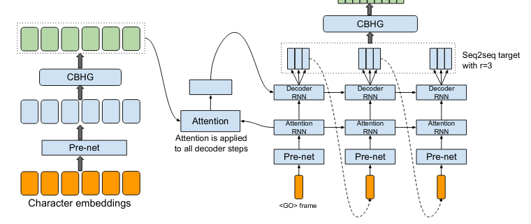

= Diacritization in Arabic with Deep Learning

== Introduction

=== General

Diacritization is the art of completing Arabic scripts with the correct
vocalization, which is a task that only advanced Arabic speakers successfully
manage.

This blog explains how we have learned to do it with an advanced research
architectures before porting it into production in _Ruby_ and _Javascript_.

=== Arabic within the landscape of languages

Arabic is used in a broad geographical area ranging from North Africa to
Afghanistan and Pakistan, and is intrinsically connected with the Islamic
civilization.

Within the main language classes, Arabic finds itself within the so-called
Abjad writing system:

* Alphabetical (English, Spanish, French, Roman, ...)
* *Abjad* (*Arabic*, Hebrew, Aramaic, ...)
* Logographic and syllabic (Chinese, Japanese, ...)
* Abugida (Hindi, Thai, Khmer, Bhurmese, ...)

Characteristics of the Abjad group is in which each symbol or glyph stands for a
consonant, in effect leaving it to readers to infer or otherwise supply an
appropriate vowel.

=== Role of diacritization

As a result, in Arabic, a set of consonants can be pronounced in several ways as
well as have multiple meanings. This ensure a great plasticity of the language
and so native speakers are used to writing this way, and to allow inference of
meanings and pronunciations from the context.

Inversely, in Arabic, unlike many other languages, the vocalization can be
exactly specified via diacritics: symbols added over or under the consonants as
in colour, in the image below.

image::figs/Elements_of_Arabic_script_improved.png[Example of Arabic with diacritization]

Writing Arabic with diacritics, called "`pointed Arabic`", is useful for
language learners.

As the diacritics provide direct instructions on pronunciation, pointed Arabic
is also important in various use cases, for instance, in sacred literature and
for praying. As a natural consequence, the Qur’an constitutes the purest
reference for diacritization.

=== Applications in informatics

Pointed Arabic is obviously useful and essential for applications to NLP usage
in *text-to-speech* and obviously *transliteration*.

== Arabic Diacritics, "`Al Tashkīl`" تَشْكِيل

=== Basic diacritics

Below, a list and examples of the basic diacritics:

image::figs/phonetics.png[Examples of Arabic diacritics]

Furthermore, some Arabic diacritics can be combined as shown below:

* Shaddah+Fatha
* Shaddah+Kasra
* Shaddah+Kasratan
* Shaddah+Dammatan
* Shaddah+Fathatah.

=== Practical examples

[example]
"`فلسطين‎`" reads "`FLSTIN`" and could be transliterated as "`Filasṭīn`" or in
Arabic after correct diacritization "`فِلَسْطِين`".

The following example demonstrates the concept of *collisions*, which highlights
the importance of context in transliteration for collision disambiguation.

[example]
"`قَطَر`" (Qatar - a country), "`قُطْر`" (Qotr - circle diameter),
"`قَطْر`" (Qatr - rain).

== Diacritization in Interscript

=== General

Interscript provides with mappings allowing to transliterate many languages into
various writing systems.

In this context, Abjad languages need to be processed via several steps:

* *Arabic text* => *diacritization* => *transliteration*

=== Diacritization with Deep Learning

Correct diacritization requires an accurate understanding not only of the
language morphemes and their variants but also the language grammar.

Furthermore, given the possible multiple meanings available to a particular word
in Arabic (or collision), some understanding of the context is required!

=== Approaches

This hard problem has been approached in various ways with an evolution quite
typical:

. Rule-based approaches
. Machine Learning approaches
. Deep Learning approaches

For more details, we have reviewed the latest publications, tested the latest
code bases and summarised the latest research ideas
https://github.com/interscript/rababa/blob/master/docs/research-Arabic-diacritization-06-2021.adoc[here].

== Production requirements

In our technology choice, we obviously want to use the best research library or
architecture.

However, we need to be able to:

* run the inference step quickly on standard CPUs;
* run the inference step from Javascript, which is achieved here with the
  following workflow:

.. Implementation and training of neural networks with PyTorch;
.. Convert PyTorch model –> ONNX model;
.. Load ONNX model from Ruby;
.. Convert Ruby –> Javascript (as documented in the
https://github.com/interscript/interscript.org/blob/master/posts/WebAssembly_and_advanced_regular_expressions_with_Opal.adoc[interscript blog])

* maintain the size of the model under 200MB; and

* publish a public, usable and documented code library.

== Training and results

=== Architecture

==== General

After careful review and testing of the latest academic literature, we have
decided to start with the
https://github.com/almodhfer/Arabic_Diacritization[public code] linked to this
recent publication:

* https://ieeexplore.ieee.org/document/9274427[Effective Deep Learning Models for Automatic Diacritization of Arabic Text (01.2021)] (abbreviated as ADAT here).

==== Encoder – Decoder + CBHG + LSTM

The current library is built on a slightly simplified version of the
https://arxiv.org/pdf/1703.10135.pdf[tacotron (04.2017)] initially developed for
text-to-speech.

The choice of the variation with CBHG is motivated by its better results
compared to other models tested and also its ability to produce fast
predictions, which is important in production.

==== Encoder - Decoder

This has been applied to various problems, like neural machine translation,
image captioning, and text-to-speech synthesis.

Obviously, the sequences under consideration are:

*Arabic symbol sequence* –> *diacritics sequence*

Below, we illustrate the full architecture. LSTM was used instead of Attention
for the RNN’s.

Even though the authors discuss attention on an encoder/decoder model, they have
not implemented it as above, so this could be a straightforward architecture to
build and test for us in the future.

==== CBHG

CBHG stands for:

* 1-D **C**onvolution **B**ank,
* **H**ighway network,
* **B**idirectional GRU.

The architecture is the core of the NNets and a modified version of feed-forward
networks with a gating mechanism that allows for information flow and
computation across multiple layers without attenuation.

image::../public/figs/cbhg.png[CBHG Architecture]

==== Preprocessing

Preprocessing in the deep learning library consists of:

* Filtering out non-Arabic characters
* Mappings the remaining characters to integers
* Embeddings

=== Datasets

* Classical Arabic Corpus (CA Corpus):

** The corpus is divided into training (94%, 2,333,825 sentences), test
(5%,124,139 sentences), and validation (1%, 24,827 sentences) sets.

* Modern Standard Arabic Corpus (MSA Corpus):

** MSA Corpus is simply: CA + MSA Corpuses

=== System Evaluation and Performance

The metrics used are standard for the problem of Arabic diacritization:

* Diacritization Error Rate *DER*:
  percentage of characters that were not correctly diacritized

* Word Error Rate *WER*:
  percentage of words that were not correctly diacritized

* with or without Case-Ending *CE*:
  exclude or not search word’s last character from error calculation since they
  mostly depend on grammatical rules.

==== Scores after Training

* *WER* and *DER* refer to without case ending metrics and are measured on the
test https://github.com/AliOsm/arabic-text-diacritization[benchmarks]. After 10
epochs, training on the above mentioned datasets, we obtained:

[cols="a,a,a,a,a",options="header"]
|===
| |WER |DER |WER* |DER*

|*Our results* |5.10 |1.24 |2.82 |0.87
|ADAT |4.47 |1.14 |2.42 |0.85

|===

(ADAT stands for results quoted in
https://ieeexplore.ieee.org/document/9274427[Effective Deep Learning Models for Automatic Diacritization of Arabic Text (01.2021)])

Even though we could not reproduce exactly the results advertised in the
article, our scores are comparably very good and within the range of the best
results up till 2021-08.

// Tacotron paper: https://arxiv.org/pdf/1703.10135.pdf[Tacotron]

== Towards production

=== In Python

Even though the original research library was written in Python, we had to build
new features and components, among other adding the ability to diacritize simple
strings or text files.

* After training, the resulting PyTorch model is
https://github.com/secryst/rababa-models/releases[released] and can be run.

=== As ONNX models

We converted our PyTorch model to ONNX models.

This is done via a Python script and we have found:

* useful to keep the sequence length flexible as a parameter of the model.
Reducing that length allows to reduce the memory required as well enhance the
NNets computation speed. It makes it possible to perform diacritization on
resource-limited architectures.

* that passing sparse parameters would lead to some imprecisions, but that a
vector like `[1,1,1,1,...]` allowed to replicate results almost perfectly with
ONNX.

* That the batch size is fixed and derived from the initial PyTorch model.

=== Ruby

* The text pre- and post-processing steps have to be rewritten.
* We used the Ruby https://github.com/secryst/onnxruntime[onnxruntime] to
  load and integrate the ONNX model.
* The work is accessible via a Ruby gem.

== Further improvements

=== Handling realistic data, with multiple scripts/symbols

In the original research paper, the trained NNets are specialised in dealing
only with Arabic.

When facing real data, we needed to find a way to reconcile diacritized Arabic
text with the hybrid, original text. We call this process "`reconciliation`".

* original string: `# گيله پسمير الجديد 34`

* diacritised string (with non Arabic removed by the NNets preprocessing):
   `يَلِهُ سُمِيْرٌ الجَدِيدُ`

* reconcile strings: algorithm => `# گيَلِهُ پسُمِيْرٌ الجَدِيدُ 34`

The https://github.com/interscript/rababa/blob/master/lib/rababa/reconcile.rb[reconciliation algorithm]
is implemented in Rababa.

=== Scoring and benchmarking processes

* Even though diacritization can be scored independently on the designated test
dataset, we have added additional practical datasets.

* As mentioned, in Interscript, the diacritization stage must take place before
transliteration. We have introduced various distance metrics to assess the full
transliteration process quality on various datasets.

=== Collision disambiguation

As mentioned above, an Arabic phrase can be applied various diacritics which
lead to different meanings. This problem is left to the Deep Learning model to
solve.

We understand, however, that a practical implementation might require special
treatment of collisions, and have experimented but we leave to future works
the following ideas to improve collision disambiguation:

* parts-of-speech tagging
* search within a Names and Geonames database

== Summary

Starting from a review of the scientific literature, we could rapidly implement
a brand new library porting cutting-edge research algorithms into production and
JavaScript.

Solving such a complex problem and porting it to a completely different
production environment was only possible thanks to the power of deep learning
and an intensive team effort.

This work was made possible by existing libraries, including
https://github.com/ankane/onnxruntime[onnxruntime],
https://github.com/interscript/opal-webassembly[opal webassembly],
https://github.com/interscript/opal-onigmo[opal onigmo] and of course
https://github.com/almodhfer/Arabic_Diacritization[almodhfer's Arabic Diacritization software].
